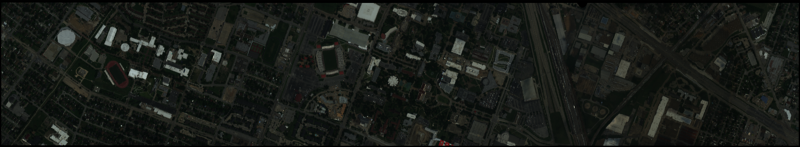

# Deep Learning Methods for Multi-modal Remote Sensing Classification


[](https://colab.research.google.com/drive/1GYbCJcNvWqoTEYszO1pfHvoJVyt-XNK7?usp=sharing)



***MMRS*** is a python tool to perform deep learning experiments on multi-modal remote sensing data.

This repository is developed on the top of [DeepHyperX](https://github.com/nshaud/DeepHyperX) . 


## Models

Currently, the following deep learning methods are available:

- [ ] [Two-Branch CNN](https://ieeexplore.ieee.org/abstract/document/8068943)
- [x] [EndNet](https://ieeexplore.ieee.org/abstract/document/9179756)
- [x] [MDL-Hong](https://ieeexplore.ieee.org/document/9174822)
- [x] [FusAtNet](https://openaccess.thecvf.com/content_CVPRW_2020/html/w6/Mohla_FusAtNet_Dual_Attention_Based_SpectroSpatial_Multimodal_Fusion_Network_for_Hyperspectral_CVPRW_2020_paper.html)
- [x] [S2ENet](https://ieeexplore.ieee.org/document/9583936) **(ours)**


## Datasets

- [Houston2013 (Hyperspectral and LiDAR Data)](https://hyperspectral.ee.uh.edu/?page_id=459): The processed .mat files can be obtained on [google drive](https://drive.google.com/file/d/1cyA7sKQlh2c7qrIb7gzexivoyXG8Vie2/view?usp=sharing).

- Trento Data (Hyperspectral and LiDAR Data): Trento dataset is provided by Professor  Prof. L. Bruzzone from the University of Trento. 


## Quickstart using Colab 

You can use *MMRS* on [Google Colab Notebook](https://colab.research.google.com/drive/1GYbCJcNvWqoTEYszO1pfHvoJVyt-XNK7?usp=sharing) without any installation. You can run all cells without any modifications to see how everything works. 


## Usage

Start a Visdom server: `python -m visdom.server` and go to [`http://localhost:8097`](http://localhost:8097/) to see the visualizations.

Then, run the script `main.py`.

The most useful arguments are:

- `--model` to specify the model (e.g. 'S2ENet', 'Middle_fusion_CNN'),
- `--dataset` to specify which dataset to use (e.g. 'Houston2013', 'Trento'),
- the `--cuda` switch to run the neural nets on GPU. The tool fallbacks on CPU if this switch is not specified.

There are more parameters that can be used to control more finely the behaviour of the tool. See `python main.py -h` for more information.

Examples:

```
!python main.py --model S2ENet --flip_augmentation --patch_size 7 --epoch 128 --lr 0.001 --batch_size 64 --seed 0 --dataset Houston2013 --folder '../' --train_set '../Houston2013/TRLabel.mat' --test_set '../Houston2013/TSLabel.mat' --cuda 0
```

For more features please refer to [DeepHyperX](https://github.com/nshaud/DeepHyperX).

